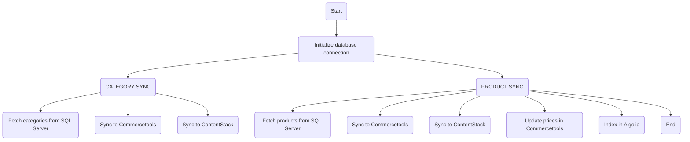

```mermaid
flowchart TD
    A(Start) --> B(Initialize database connection)
    B --> C(CATEGORY SYNC)
    C --> D(Fetch categories from SQL Server)
    C --> E(Sync to Commercetools)
    C --> F(Sync to ContentStack)
    B --> G(PRODUCT SYNC)
    G --> H(Fetch products from SQL Server)
    G --> I(Sync to Commercetools)
    G --> J(Sync to ContentStack)
    G --> K(Update prices in Commercetools)
    G --> L(Index in Algolia)
    G --> M(End)

```
